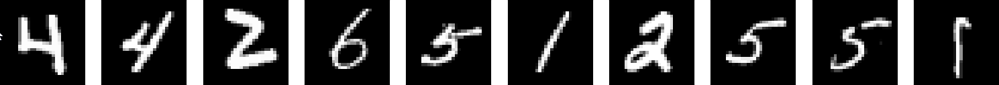
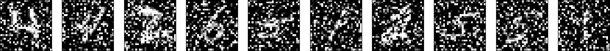
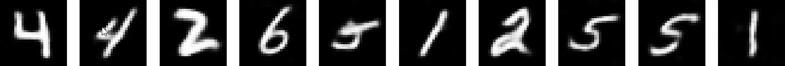
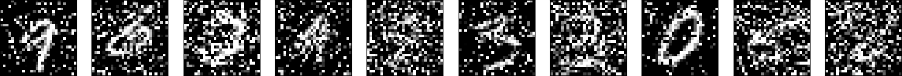
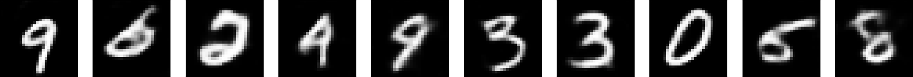

# denoising-conv-autoencoder

Denoising convolutional autoencoder and classifier for the MNIST handwritten digit database.

* [Download](https://drive.google.com/file/d/16AUgKIYShhEpBGs2WGihy-P6veVG8rJU/view?usp=sharing) the noisy dataset and extract it inside project's folder 
  * Salt, pepper, and random noise is added to the MNIST handwritten digit database.
  * You can easily generate a new dataset accordingly to your needs by tuning the noise parameters

| Dataset       | 25%                     | 
| :-----:       | :-----:                 |            
| Original      |    |
| Noisy         |    | 
| Decoded       |    |
| Dataset       | 50%                     |
| Original      |    |
| Noisy         |    | 
| Decoded       |    | 
| Dataset       | [10%, 75%]              | 
| Original      |    |
| Noisy         |    | 
| Decoded       |    | 

## To-Do
