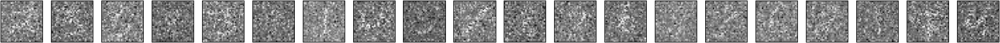
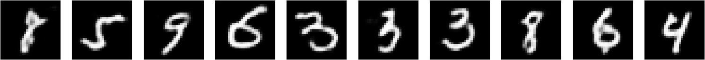

# denoising-conv-autoencoder

Convolutional denoising autoencoder with symmetric skip connections and classifier for the noisy (salt, pepper, and random noise) MNIST handwritten digit database. 

* [Download](https://drive.google.com/file/d/16AUgKIYShhEpBGs2WGihy-P6veVG8rJU/view?usp=sharing) the noisy dataset and extract it inside project's folder 
  * Salt, pepper, and random noise is added to the MNIST handwritten digit database.
  * You can easily generate a new dataset accordingly to your needs by tuning the noise parameters

| Noise         | 75%                         | 
| :-----:       | :-----:                     |            
| Noisy         |       |
| Denoised      |    | 
| Original      |    | 

## To-Do
