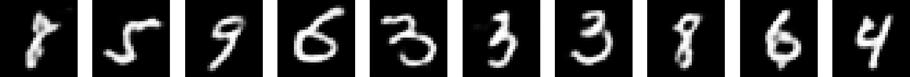

# denoising-conv-autoencoder

Denoising convolutional autoencoder for the  MNIST handwritten digit database.

The amount of noise can be easilly adjustable.

Digits with noise (salt and peper, and random noise): 

Denoised digits using denoising convolutional neural network: 

GIF for comparison: 

